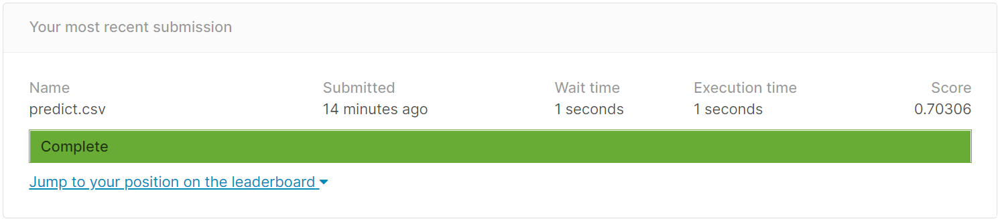

# work6

## GiveMeSomeCredit

Start here! Predict the probability that somebody will experience financial distress in the next two years (column=SeriousDlqin2yrs).

[GiveMeSomeCredit](https://www.kaggle.com/c/GiveMeSomeCredit/overview)

## Steps

1. perform *k*-fold cross-validation on the training data under three-way split to select the best prediction model
    + you could try many different models, then only implement the best model in your code
2. report the average AUC of cross-validation (training, validation, testing in *k*-fold cross-validation i.e., hw4) with the option, --report
3. *k* = ?, with the highest test AUC in *k*-fold cross-validation 
4. then apply the selected model on the Kaggle test data
5. output prediction result (--predict)
   
```R
Rscript hw6_studentID.R --fold n --train Data/train.csv --test Data/test.csv --report performance.csv --predict predict.csv
```



