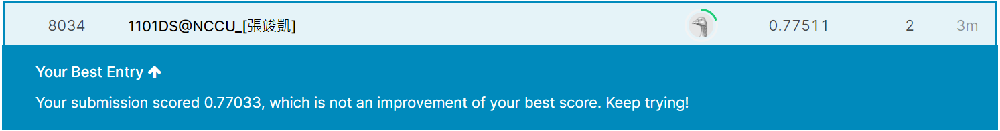

# work5

## Titanic: Machine Learning from Disaster

Start here! Predict survival on the Titanic and get familiar with Machine Learning basics

[Kaggle Titanic](https://www.kaggle.com/c/titanic)

## Steps

1. perform *n*-fold cross-validation on the training data under three-way split to select the best prediction model
2. report the average accuracy of cross-validation (training, validation, testing in *n*-fold cross-validation), i.e., hw3
3. then apply the selected model on the test data
4. output prediction result

```R
Rscript hw5_studentID.R --fold n --train Titanic_Data/train.csv --test Titanic_Data/test.csv --report performance.csv --predict predict.csv
```



